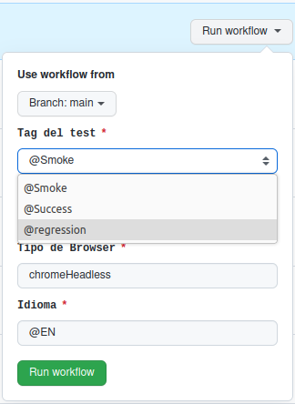
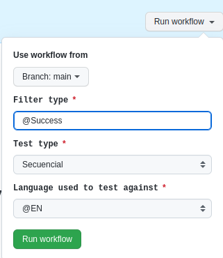

# Pipeline Sample API

Es un proyecto que tiene como finalidad automatizar el testeo del codigo ingresado al repositorio, utilizando el framework Lippia.

## Consideraciones
El proyecto incluye la imagen de Lippia con todas las herramientas necesarias para los tests. En la carpeta .github/workflows se encuentran dos archivos de automatización de pipelines que se ejecutan segun donde se haga el commit o el merge:
- Cuando el commit se realiza a main o master el test se ejecuta automaticamente con el archivo Workflow-API-Auto.yml
- Cuando el commit se realiza a otro branch el test se debe ejecutar manualmente, corriendo el archivo Workflow-API-Manual.yml

### Como se usa
- Un nuevo commit en el repositorio a las branches "main" o "master" dispara el pipeline, iniciando las pruebas pertinentes. Si se desea cambiar esto se puede modificar en la siguiente sección del documento:

```
on: 
 push:
  branches: [ 'main', 'master', 'test', 'dev' ] # Se agregan las ramas "test" y "dev" a las pruebas automáticas.

 #para tener en cuenta
      - '*'         # coincide con cada rama que no contiene un '/'
      - '*/*'       # coincide con cada rama que contiene un solo '/'
      - '**'        # coincide con cualquier rama
      - '!master'   # excluye la rama master
```
*Este pipeline trabaja con la version de lippia 3.1.2.2, en caso de querer modificarla utilizar una imagen desde el siguiente link:
>https://hub.docker.com/r/crowdar/lippia/tags

- Antes de disparar el pipeline se deben configurar las siguientes variables de entorno dentro del archivo .github/workflows/Workflow-API-Auto.yml en "jobs: testing: env:", los valores de dichas variables se encuentran en el archivo POM.xml:
  * **TAG**: lleva el nombre de la prueba
  * **TESTTYPE**:  determina el tipo de pruebas a realizar
  * **LANG**: determina el idioma

- Si los test requieren variables adicionales o diferentes, se debe modificar esta sección del archivo para reflejar el cambio.

```
    env: 
      TAG: "@Success"
      TESTTYPE: "Secuencial"
      LANG: "@EN"
```

**NOTA:  el pipeline permite modificar o agregar mas variables de entorno dentro del apartado "env"**

- En caso de que el commit sea realizado a un branch que no sea main o master, se deberá ejecutar manualmente el pipeline correspondiente al archivo .github/workflows/Workflow-API-Manual.yml declarando las variables o seleccionando las mismas en el contexto de ejecución.

- Si hiciera falta modificar estas variables se pueden modificar al comienzo del archivo en el apartado "inputs:" y en el apartado "env:" para que coincidan.

```
inputs:
  filter:
        description: 'Filter type'
        required: true
        default: 'warning'
        type: choice
        options:
        - '@Smoke'
        - '@Success'
        - '@regression' #se agrega este test que aparecera en la lista al disparar el pipeline
  ```




- Se puede seleccionar una variable del tipo "Choice" para darle al usuario la opción de elegir entre opciones prefijadas, o usar variables tipo "input" para dejar un campo de texto libre.
```
inputs:
      #filter:
        #description: 'Filter type'
        #required: true
        #default: 'warning'
        #type: choice
        #options:
        #- '@Smoke'
        #- '@Success'
      filter:
        description: 'Filter type'
        required: true
        default: '@Success'
        type: input
```


  
* para realizar las pruebas utilizamos el comando: 
```
$ mvn clean test
```


### Los reportes son generados en una carpeta llamada **Target**, que sera generada una vez que la ejecucion de las pruebas haya finalizado.

**para mas informacion ver [documentacion lippia.](https://github.com/Crowdar/lippia-web-sample-project#getting-started "documentacion lippia.")**
